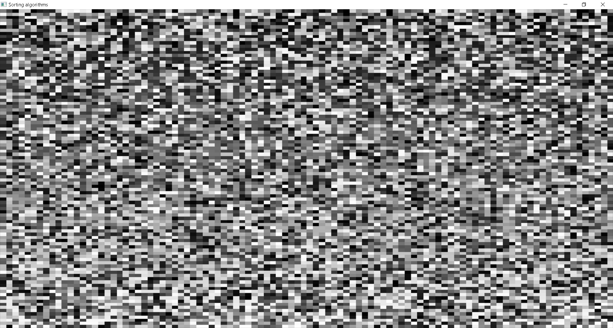
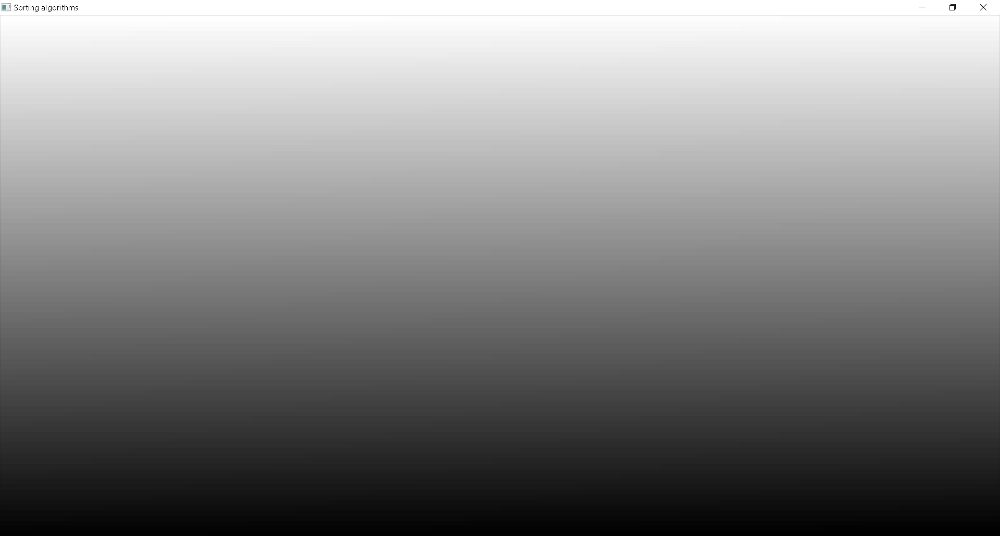

# Sorting_Algorithms

We have an [int] array visually represented in this pixel table.

It can be sorted by three different methods: bubblesort, mergesort and quicksort.

Controls:
```
Space: Randomize array.
Q: Quicksort
B: Bubblesort
M: Mergesort
```

## Unsorted array
<p align="left">
    
</p>

## Sorted array
<p align="left">
    
</p>

## Sorted array 2
<p align="left">
    
</p>
